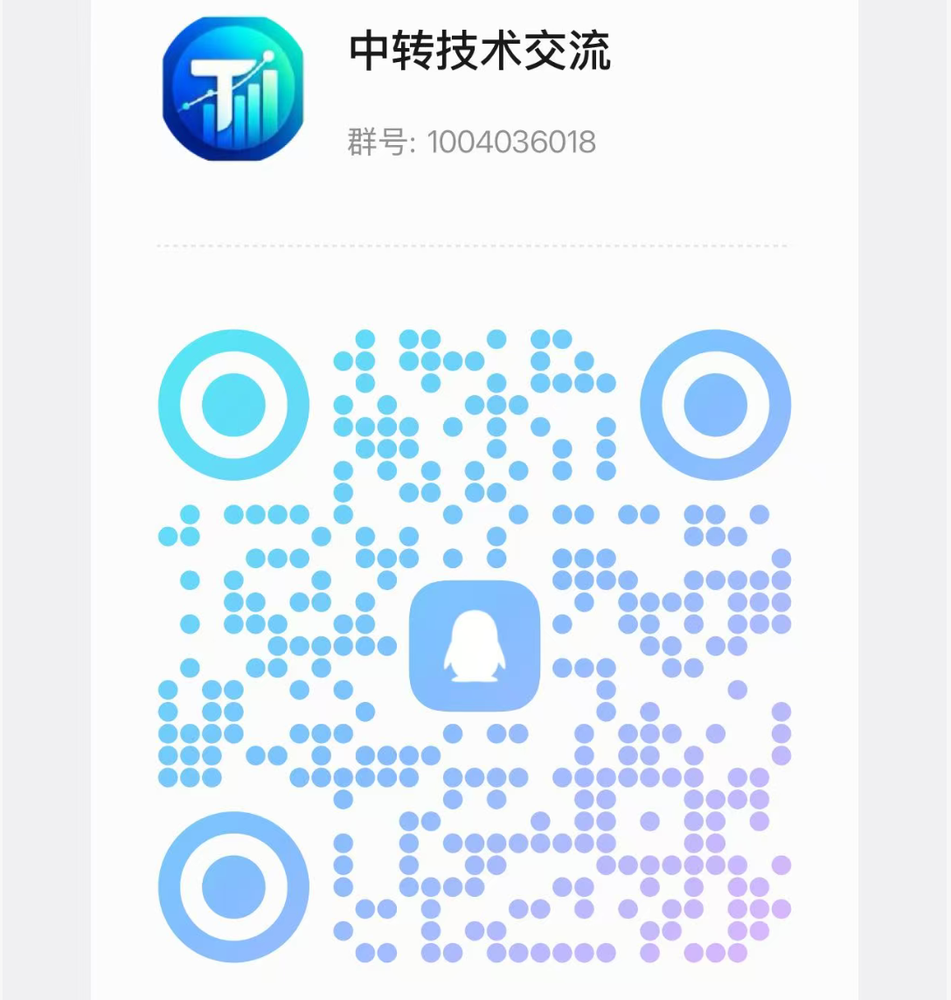
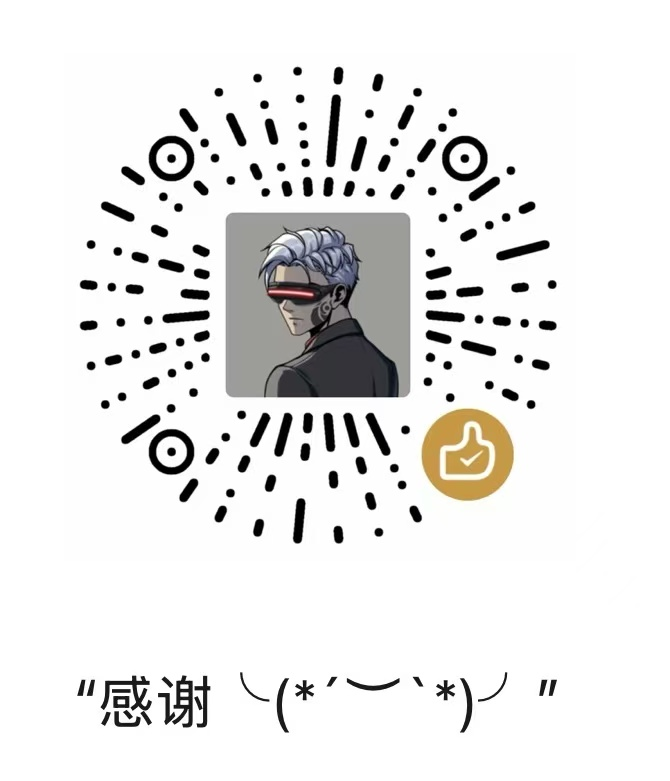

# Sub2API

**tosky.io 维护的 Sub2API 独立分支**

English | [简体中文](README_CN.md) | [日本語](README_JA.md)

> Public transit snapshot distribution: this branch adds a machine-readable
> public pricing, group, cache, and availability export for Sub2API stations.
> See [README_PUBLIC_TRANSIT_CN.md](README_PUBLIC_TRANSIT_CN.md) for the
> station-owner integration guide.

## ⚠️ Important Notice

欢迎正在部署、使用或维护 Sub2API 的朋友加入 QQ 群「中转技术交流」（群号 **1004036018**），交流部署实践、协议兼容、出口代理和功能改进。也欢迎参与问题复现、测试、文档补充和 Pull Request，一起维护这个独立分支。

<table>
<tr>
<td align="center" width="50%">
  
   
  加入 QQ 群「中转技术交流」
</td>
<td align="center" width="50%">
  
   
  如果帮到大家可以打赏咖啡！
</td>
</tr>
</table>

二维码长期有效。需要长期留档、报告问题或讨论具体改动时，请使用 [Issues](https://github.com/ranxi2001/sub2api/issues)。

## 本仓库的维护方向

基于 [Wei-Shaw/sub2api](https://github.com/Wei-Shaw/sub2api) 持续维护，按需 cherry-pick 上游更新，同时保留并迭代自己的功能。默认分支为 `production`，发布版本和更新源均使用本仓库。

- **DeepSeek 与 Codex 适配**：支持 Responses 到 Chat Completions 的转换、工具调用历史和上下文压缩兼容。配置模型映射后，可通过切换 API Key 分组使用 DeepSeek，沿用客户端配置。[操作教程](https://tosky.io/docs/?doc=deepseek-switch-group)
- **Codex ticket 管理**：提供后台采集、注入、模型选择及账号状态展示；相关开关和采集代理由管理员配置。
- **Mihomo 出口管理**：集成采集出口管理、票据刷新策略和节点状态操作，日常业务代理与采集出口分别配置。
- **独立发布与升级**：使用 `ranxi2001/sub2api` 的 Release、安装资源和容器镜像，具体版本变化见 [更新说明](https://github.com/ranxi2001/sub2api/releases)。

## 项目概述

Sub2API 是一个 AI API 网关平台，用于分发和管理 AI 产品订阅的 API 配额。用户通过平台生成的 API Key 调用上游 AI 服务，平台负责鉴权、计费、负载均衡和请求转发。

## 核心功能

- **多账号管理** - 支持多种上游账号类型（OAuth、API Key）
- **API Key 分发** - 为用户生成和管理 API Key
- **精确计费** - Token 级别的用量追踪和成本计算
- **智能调度** - 智能账号选择，支持粘性会话
- **并发控制** - 用户级和账号级并发限制
- **速率限制** - 可配置的请求和 Token 速率限制
- **内置支付系统** - 支持 EasyPay 易支付、支付宝官方、微信官方、Stripe，用户自助充值，无需独立部署支付服务（[配置指南](docs/PAYMENT_CN.md)）
- **管理后台** - Web 界面进行监控和管理
- **外部系统集成** - 支持通过 iframe 嵌入外部系统（如工单等），扩展管理后台功能

## 技术栈

| 组件 | 技术 |
|------|------|
| 后端 | Go 1.27.0, Gin, Ent |
| 前端 | Vue 3.4+, Vite 5+, TailwindCSS |
| 数据库 | PostgreSQL 15+ |
| 缓存/队列 | Redis 7+ |
| API 协议 | OpenAI Responses / Chat Completions、Anthropic Messages、Gemini、SSE、WebSocket |
| 调度与可靠性 | 粘性会话、并发控制、限流、故障转移、ticket 准入与冷却 |
| 观测与运维 | 结构化日志、请求分段耗时、健康检查、Mihomo 出口与 systemd |
| 交付与质量 | Docker Compose、GitHub Actions、Go 单元测试、前端类型检查与构建 |

## 贡献与协作

欢迎围绕协议兼容、账号调度、Codex ticket、支付计费、管理后台和运维观测提交改进。高质量贡献应尽量保持边界清晰，并在 PR 中说明请求路径、状态变化、兼容性影响和验证证据。

建议按以下方式提交：

- **协议与网关**：补充请求/响应样例，覆盖流式终止、工具调用、重试和上游错误映射。
- **调度与账号**：说明候选筛选、粘性状态、并发占用、冷却窗口和故障转移行为，避免改变幂等语义。
- **后台与配置**：同步前后端类型、默认值、权限边界和迁移兼容性。
- **运维与部署**：提供离线或 mock 验证，不在 PR 中写入 Token、ticket、代理凭据或生产配置。
- **验证与审查**：列出实际运行的测试、构建或脚本检查；未运行的检查不要标记为通过。

感谢已合并 PR 的贡献者：

  
  
  
  
  
  
  

---

## ⚠️ 重要提醒

使用本项目前，请务必仔细阅读以下内容：

- **🚨 服务条款风险**：使用本项目可能违反 Anthropic 等上游服务商的服务条款。请在使用前仔细阅读相关服务商的用户协议，由此产生的一切风险由用户自行承担。
- **⚖️ 合规使用**：请在符合您所在国家或地区法律法规的前提下使用本项目，严禁将其用于任何违法违规用途。
- **📖 免责声明**：本项目仅供技术学习与研究使用，作者不对因使用本项目导致的账户封禁、服务中断、数据丢失或其他任何直接或间接损失承担责任。
- **🚫 无商业授权**：本项目从未授权任何个人或组织基于本项目开展任何形式的商业化运营。任何以本项目名义或基于本项目从事的商业行为均与本项目及其开发者无关，由此产生的一切纠纷、损失和法律责任由行为主体自行承担。

## 许可证

本项目基于 [GNU 宽通用公共许可证 v3.0](LICENSE)（或更高版本）授权。

Copyright (c) 2026 Wesley Liddick

---

**如果觉得有用，请给个 Star 支持一下！**

